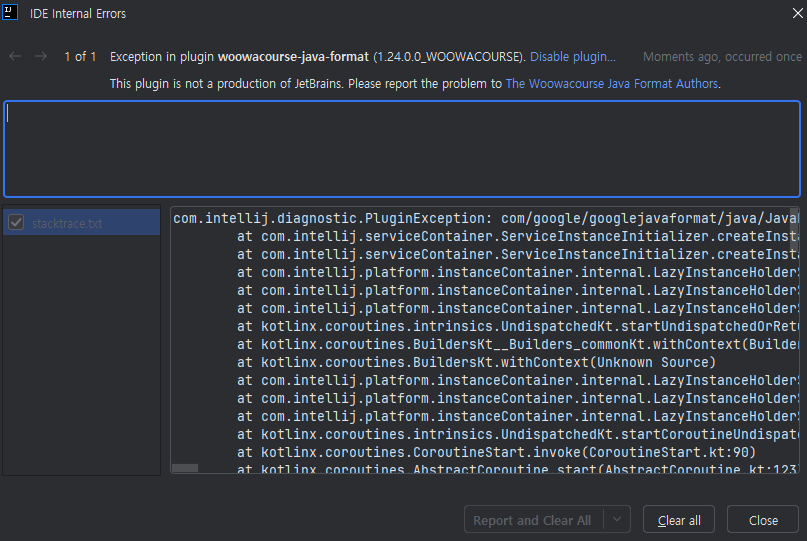

# woowacourse-java-format

`woowacourse-java-format`은 [google-java-format][]을 수정한 프로그램입니다. Java 소스 코드를 우아한테크코스의 [Java Style Guide][]에 맞게 포매팅합니다.

기존에 제공되던 [IDE별 설정 파일][]도 간편하게 수정할 수 있지만, 정밀하지 않다는 문제를 발견하고 개발했습니다. 가령 IntelliJ와 Eclipse의 설정에서 지원하는 기능이 다르고 Visual Studio Code는 줄 바꿈 시 이어지는 들여쓰기 칸 수를 별도로 설정할 수 없습니다. [google-java-format][] 개발을 선택한 이유는 import 순서까지 고치는 등 소위 영혼까지 포매팅한다고 언급하기 때문입니다:

> a new Java formatter that follows the Google Java Style
> Guide quite precisely---to the letter and to the spirit.

[Google Java Style Guide][]과의 차이점은 들여쓰기가 +2칸, 줄 바꿈 시 이어지면 +4칸, 열 제한이 100칸이 아니라는 것입니다. 들여쓰기를 2배 즉 +4칸, +8칸으로, 열 제한을 100칸에서 120칸으로 늘렸습니다. 다음과 같이 정책적으로 설정을 지원하지 않는다는 안내에 따라 따로 개발하고 배포합니다:

> ***Note:*** *There is no configurability as to the formatter's algorithm for
> formatting. This is a deliberate design decision to unify our code formatting on
> a single format.*

[google-java-format]: https://github.com/google/google-java-format
[Java Style Guide]: https://github.com/woowacourse/woowacourse-docs/tree/main/styleguide/java
[Google Java Style Guide]: https://google.github.io/styleguide/javaguide.html
[IDE별 설정 파일]: https://github.com/google/styleguide/blob/gh-pages/intellij-java-google-style.xml

## Contributing

일반 사용자를 넘어 간단한 의견 공유부터 코드 리뷰, 테스트 코드 오류 제보 등을 통해 `The Woowacourse Java Format Authors`에 합류해 보세요 :tada: 참고로 소스 코드 수정이 테스트 코드 수정보다 훨씬 적었답니다!

## 사용법

[다운로드][]하고 [google-java-format][https://github.com/google/google-java-format/releases] 대신 사용할 수 있습니다.

[다운로드]: https://github.com/yhkee0404/woowacourse-java-format/releases

### 바로 실행해 보기

`woowacourse-java-format-1.24.0-all-deps.jar` 파일을 [다운로드][]하고 Java로 실행할 수 있습니다. Java 독립적인 운영체제별 실행 파일은 곧 배포할 예정입니다.

`--aosp` (Android Open Source Project (AOSP) style로 import 고치기) 등 터미널에서 사용 가능한 CLI 옵션은 `--help`를 참고하세요. `git diff`와도 연동할 수 있습니다: [google-java-format-diff.py][].

```zsh
java -jar woowacourse-java-format-1.24.0-all-deps.jar Sample.java
```

[google-java-format-diff.py]: https://github.com/yhkee0404/woowacourse-java-format/blob/main/scripts/woowacourse-java-format-diff.py

### Visual Studio Code에서 사용하기

`Format Document` 그리고 `Organize Imports`와 연동할 수 있습니다.

[Google Java Format for VS Code][] Extension을 설치하고 `woowacourse-java-format-1.24.0-all-deps.jar` 파일 경로를 입력한 다음 저장하세요: `settings.json`에서 `java.format.settings.google.executable`, 또는 `File > Preferences > Settings > Extensions > google-java-format-for-vs-code > Java > Format > Settings > Google: Executable`


단축키를 참고하세요: `(Command(or Control) + Shift + P`


[Google Java Format for VS Code]: https://marketplace.visualstudio.com/items?itemName=JoseVSeb.google-java-format-for-vs-code

### IntelliJ, Android Studio 등 JetBrains IDE용 Plugin 설치하기

`Reformat Code` 그리고 `Optimize Imports`와 연동할 수 있습니다.

#### IntelliJ JRE Config

설치하기에 앞서 `Help > Edit Custom VM Options...`에서 다음을 입력하고 저장한 후 창을 끄고 재시작해 주세요.

```
--add-exports=jdk.compiler/com.sun.tools.javac.api=ALL-UNNAMED
--add-exports=jdk.compiler/com.sun.tools.javac.code=ALL-UNNAMED
--add-exports=jdk.compiler/com.sun.tools.javac.file=ALL-UNNAMED
--add-exports=jdk.compiler/com.sun.tools.javac.parser=ALL-UNNAMED
--add-exports=jdk.compiler/com.sun.tools.javac.tree=ALL-UNNAMED
--add-exports=jdk.compiler/com.sun.tools.javac.util=ALL-UNNAMED
```


다음으로 `idea_plugin.zip` 파일을 [다운로드][]하고 `File > Settings > Plugins > Install Plugin from Disk...`에서 선택합니다. Marketplace 등록은 아직 진행 중이니 [다운로드][]해 주세요.


프로젝트별 활성화가 필요합니다: `File > Settings > woowacourse-java-format Settings`

Code Style은 import 순서를 의미하며 들여쓰기 등은 동일합니다.


번거로운 활성화 대신 새 프로젝트마다 기본으로 설정할 수도 있습니다: `File > New Projects Setup > Settings for New Projects...`

`File > Settings`와 비슷해 보이지만 달라서, `Other Settings`가 보이는지 여부로 구별할 수 있습니다.


단축키를 참고하세요: `Double Shift > Actions`


### Eclipse

`woowacourse-java-format-eclipse-plugin-1.24.0.0_WOOWACOURSE.jar` 파일을 [다운로드][]하고 [dropins][]에 폴더에 옮겨 주세요. `Window > Preferences > Java > Code Style > Formatter > Formatter Implementation > woowacourse-java-format`에서 설정할 수 있습니다.

[dropins]: http://help.eclipse.org/neon/index.jsp?topic=%2Forg.eclipse.platform.doc.isv%2Freference%2Fmisc%2Fp2_dropins_format.html

### 기타 Plugin 설치하기

다양한 IDE를 지원하는 [Spotless Integration]도 연동할 수 있습니다. Gradle Plugin, Maven Plugin도 있고, GitHub Actions도 있습니다. 다만 IntelliJ처럼 [VM Options](#intellij-jre-config) 설정이 필요할지도 모릅니다: JDK 16 이후 [JEP 396][]: Strongly Encapsulate JDK Internals by Default

[JEP 396]: https://openjdk.java.net/jeps/396
[Spotless Integration]: https://github.com/diffplug/spotless/blob/main/plugin-gradle/IDE_HOOK.md
[Spotless Plugin]: https://github.com/diffplug/spotless/tree/main/plugin-gradle#google-java-format

*   Gradle plugins
    *   [Spotless Plugin][]
    *   [sherter/google-java-format-gradle-plugin](https://github.com/sherter/google-java-format-gradle-plugin)
*   Apache Maven plugins
    *   [Spotless Plugin][]
    *   [spotify/fmt-maven-plugin](https://github.com/spotify/fmt-maven-plugin)
    *   [talios/googleformatter-maven-plugin](https://github.com/talios/googleformatter-maven-plugin)
    *   [Cosium/maven-git-code-format](https://github.com/Cosium/maven-git-code-format):
        Commit할 때마다 자동 포매팅
*   SBT plugins
    *   [sbt/sbt-java-formatter](https://github.com/sbt/sbt-java-formatter)
*   [Github Actions](https://github.com/features/actions)
    *   [googlejavaformat-action](https://github.com/axel-op/googlejavaformat-action):
        Push할 때마다 자동 포매팅

### Java 소스 코드에서 함수 사용하기

package나 디렉토리 이름에 `woowacourse`를 반영하지 않았습니다. [Upstream][google-java-format]과의 비교를 쉽게 하기 위해서입니다.

```java
import com.google.googlejavaformat.java.Formatter;
```

```java
String formattedSource = new Formatter().formatSource(sourceString);
```

```java
CharSource source = ...
CharSink output = ...
new Formatter().formatSource(source, output);
```

#### Maven으로 설치하기

저장소 등록은 아직 진행 중입니다. `eclipse_plugin/` 디렉토리의 [pom.xml][]을 참고하세요:

```xml
  <dependencies>
    <dependency>
      <groupId>com.github.yhkee0404.woowacoursejavaformat</groupId>
      <artifactId>woowacourse-java-format</artifactId>
      <version>${project.version}</version>
    </dependency>
  </dependencies>

  <repositories>
    <repository>
        <id>in-project</id>
        <name>custom jars</name>
        <url>file://${project.basedir}/../core/target</url>
    </repository>
  </repositories>
```

[pom.xml]: https://github.com/yhkee0404/woowacourse-java-format/blob/main/eclipse_plugin/pom.xml
[build.gradle.kts]: https://github.com/yhkee0404/woowacourse-java-format/blob/main/idea_plugin/build.gradle.kts

#### Gradle로 설치하기

저장소 등록은 아직 진행 중입니다. `idea_plugin/` 디렉토리의 [build.gradle.kts][]을 참고하세요:

```kotlin
dependencies {
  implementation("com.github.yhkee0404.woowacoursejavaformat:woowacourse-java-format:${googleJavaFormatVersion}")
}

repositories {
  flatDir {
      dirs("../core/target")
  }
}
```

## 빌드해 보기

다음 파일들을 빌드할 수 있습니다.

```zsh
core/target/woowacourse-java-format-1.24.0.0_WOOWACOURSE-all-deps.jar
core/target/woowacourse-java-format-1.24.0.0_WOOWACOURSE-javadoc.jar
core/target/woowacourse-java-format-1.24.0.0_WOOWACOURSE-sources.jar
core/target/woowacourse-java-format-1.24.0.0_WOOWACOURSE.jar
eclipse_plugin/target/woowacourse-java-format-eclipse-plugin-1.24.0.0_WOOWACOURSE.jar
idea_plugin/build/distributions/idea_plugin.zip
```

[docker-compose.yml][] 파일을 참고하세요:

```zsh
docker compose up -d core
```

core 빌드를 마치면 idea_plugin도 빌드할 수 있습니다.

그러나 core와 달리 idea_plugin은 빌드 성공에도 불구하고 다음 오류가 발생했으니 참고하세요. 그래서 idea_plugin 빌드는 IntelliJ에서 해 보시기 바랍니다.

[다운로드][]의 `idea_plugin.zip`은 IntelliJ에서 빌드해서 괜찮습니다.



혹시 윈도우 등에서 Docker Container가 `root` 사용자로 실행되어 파일 소유자가 변경된 경우가 `ls -al` 등으로 확인된다면 다음 실행으로 해결할 수 있습니다:

```zsh
sudo chown -R `id -u` .
```

`idea_plugin/`는 빌드 성공에도 불구하고 에러 메시지가 많은데 이유는 아직 모르겠습니다!

[docker-compose.yml]: https://github.com/yhkee0404/woowacourse-java-format/blob/main/docker-compose.yml

