# woowacourse-java-format

> ***New:*** [Pull Request 전 체크리스트][] 항목 중 "코드 한 줄에 점(.)을 하나만 허용했는가?" 지원 기능을 추가했습니다! [v1.24.0.14_WOOWACOURSE][]부터 적용되고 Expression 단위로 두 번째 점(.)부터 줄 바꿈을 강제합니다.  
> [Jetbrains Marketplace][]보다 [다운로드][]에 먼저 배포됩니다. [intellij-java-google-style.xml][]의 테스트 결과와 비교하며 [코드 리뷰][]를 해 주세요!
> 
> ### 코드 한 줄에 점(.)을 하나만 허용했는가?
> * 디미터(Demeter)의 법칙(“친구하고만 대화하라”)을 지켰는가?
> * 예를 들어 location.current.representation.substring(0, 1)와 같이 여러 개의 점(.)이 등장하면 리팩토링할 부분을 찾아본다.

[v1.24.0.14_WOOWACOURSE]: https://github.com/yhkee0404/woowacourse-java-format/releases/tag/v1.24.0.14_WOOWACOURSE
[Pull Request 전 체크리스트]: https://github.com/woowacourse/woowacourse-docs/blob/main/cleancode/pr_checklist.md
[코드 리뷰]: https://github.com/yhkee0404/woowacourse-java-format/compare/test-resources-intellij-wooteco-xml-java-imports-and-formatting..1b55c7e731d88cab41141227f27589a14f320756

`woowacourse-java-format`은 [google-java-format][]을 수정한 프로그램입니다. Java 소스 코드를 우아한테크코스의 [Java Style Guide][]에 맞게 포매팅합니다.

기존에 제공되던 [IDE별 설정 파일][intellij-java-google-style.xml]도 간편하게 수정할 수 있지만, 정밀하지 않다는 문제를 발견하고 개발했습니다. 가령 IntelliJ와 Eclipse의 설정에서 지원하는 기능이 다르고 Visual Studio Code에서 권장하는 [Language Support for Java(TM) by Red Hat][]은 줄 바꿈 시 이어지는 들여쓰기 칸 수를 별도로 설정할 수 없습니다. [google-java-format][] 개발을 선택한 이유는 Import 순서까지 고치는 등 소위 영혼까지 포매팅한다고 언급하기 때문입니다: [Why we need IDEA plugin as we already can import the xml file?][]

> a new Java formatter that follows the Google Java Style
> Guide quite precisely---to the letter and to the spirit.

[Language Support for Java(TM) by Red Hat]: https://marketplace.visualstudio.com/items?itemName=redhat.java
[Why we need IDEA plugin as we already can import the xml file?]: https://github.com/google/google-java-format/issues/308#issuecomment-420175773

[Google Java Style Guide][]과의 차이점은 들여쓰기가 +2칸, 줄 바꿈 시 이어지면 +4칸, 열 제한이 100칸이 아니라는 것입니다. 들여쓰기를 2배 즉 +4칸, +8칸으로, 열 제한을 100칸에서 120칸으로 늘렸습니다. 다음과 같이 정책적으로 설정을 지원하지 않는다는 안내에 따라 따로 개발하고 배포합니다:

> ***Note:*** *There is no configurability as to the formatter's algorithm for
> formatting. This is a deliberate design decision to unify our code formatting on
> a single format.*

[google-java-format]: https://github.com/google/google-java-format
[Java Style Guide]: https://github.com/woowacourse/woowacourse-docs/tree/main/styleguide/java
[Google Java Style Guide]: https://google.github.io/styleguide/javaguide.html
[intellij-java-google-style.xml]: https://github.com/google/styleguide/blob/gh-pages/intellij-java-google-style.xml

## Contributing

일반 사용자를 넘어 간단한 의견 공유부터 코드 리뷰, 테스트 코드 오류 제보 등을 통해 `The Woowacourse Java Format Authors`에 합류해 보세요 :tada: 참고로 소스 코드 수정이 테스트 코드 수정보다 훨씬 적었답니다!

## 사용법

[Jetbrains Marketplace][]에서 바로 설치하거나, GitHub Releases에서 [다운로드][]하고 [google-java-format](https://github.com/google/google-java-format/releases) 대신 사용할 수 있습니다. [Jetbrains Marketplace][]보다 [다운로드][]에 먼저 배포됩니다. 

[Jetbrains Marketplace]: https://plugins.jetbrains.com/plugin/25728-woowacourse-java-format
[다운로드]: https://github.com/yhkee0404/woowacourse-java-format/releases

### IntelliJ, Android Studio 등 JetBrains IDE에 Plugin 설치하기

`Reformat Code` 그리고 `Optimize Imports`와 연동할 수 있습니다.

#### IntelliJ JRE Config

설치하기에 앞서 `Help > Edit Custom VM Options...`에서 다음을 입력하고 저장해 주세요:

```
--add-exports=jdk.compiler/com.sun.tools.javac.api=ALL-UNNAMED
--add-exports=jdk.compiler/com.sun.tools.javac.code=ALL-UNNAMED
--add-exports=jdk.compiler/com.sun.tools.javac.file=ALL-UNNAMED
--add-exports=jdk.compiler/com.sun.tools.javac.parser=ALL-UNNAMED
--add-exports=jdk.compiler/com.sun.tools.javac.tree=ALL-UNNAMED
--add-exports=jdk.compiler/com.sun.tools.javac.util=ALL-UNNAMED
```

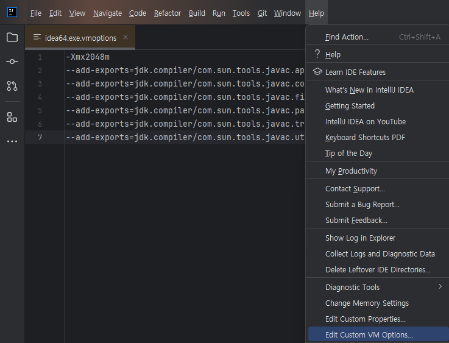

`File > Settings > Plugins > Marketplace`에서 [woowacourse-java-format][Jetbrains Marketplace]을 검색해 설치할 수 있습니다. 또는 GitHub Releases에서 최신 버전의 [project.zip][]을 직접 다운로드하고 [빌드해 보기](#빌드해-보기)와 같이 설치할 수도 있습니다. 설치한 후 재시작이 필요합니다.

[project.zip]: https://github.com/yhkee0404/woowacourse-java-format/releases/latest/download/project.zip

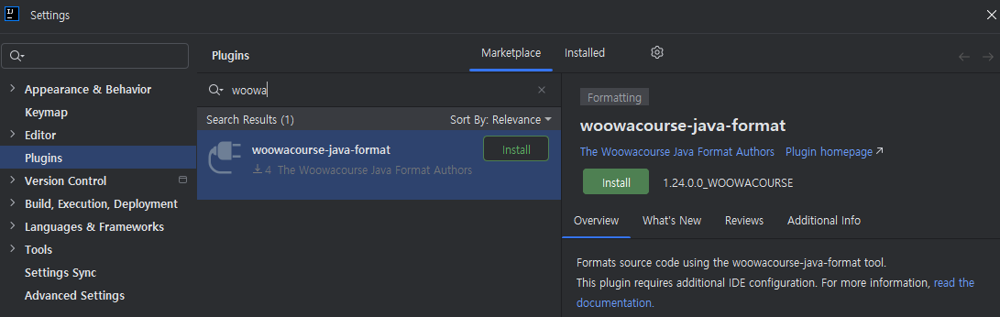

재시작한 다음부터는 프로젝트별 활성화가 필요합니다: `File > Settings > woowacourse-java-format Settings > Enable woowacourse-java-format`

Code Style은 Import 순서를 의미하며 들여쓰기 등은 동일합니다.

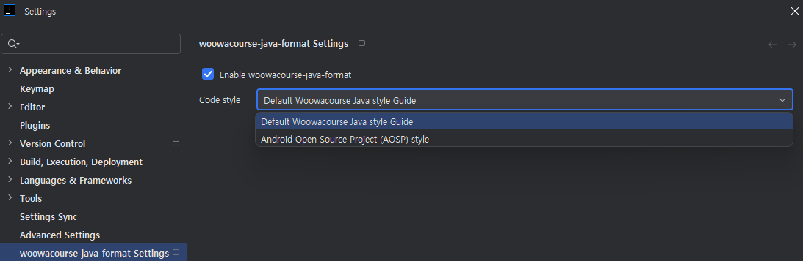

번거로운 활성화 대신 새 프로젝트마다 기본으로 활성화할 수도 있습니다: `File > New Projects Setup > Settings for New Projects...`

`File > Settings`와 비슷해 보이지만 달라서, `Other Settings`가 보이는지 여부로 구별할 수 있습니다:

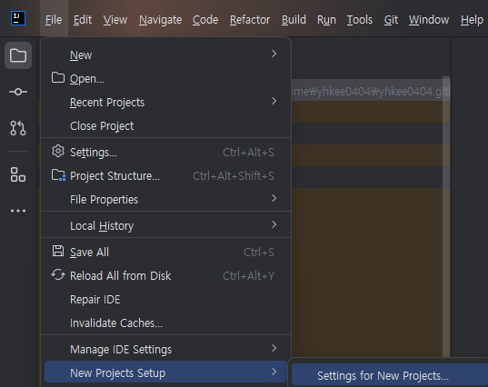

단축키를 참고하세요: `Double Shift > Actions`

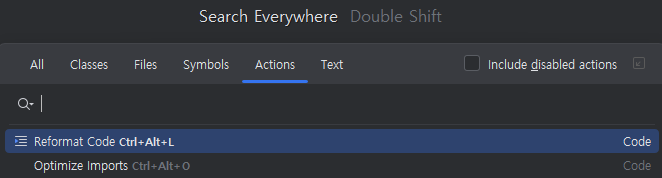

### [다운로드][]하고 바로 실행하기

운영체제별 실행 파일을 [다운로드][]할 수 있습니다. 또는 `woowacourse-java-format-1.25.0.0_WOOWACOURSE-all-deps.jar` 파일을 [다운로드][]하고 Java로 실행할 수 있습니다.

```zsh
woowacourse-java-format_windows-x86-64.exe Sample.java
```

```zsh
java -jar woowacourse-java-format-1.25.0.0_WOOWACOURSE-all-deps.jar Sample.java
```

`--aosp` (Android Open Source Project (AOSP) Style로 Import 고치기) 등 터미널에서 사용 가능한 CLI 옵션은 `--help`를 참고하세요. `git diff`와도 연동할 수 있습니다: [google-java-format-diff.py][]

[google-java-format-diff.py]: https://github.com/yhkee0404/woowacourse-java-format/blob/main/scripts/woowacourse-java-format-diff.py

### [다운로드][]하고 Visual Studio Code에 Extension 설치하기

`Format Document` 그리고 `Organize Imports`와 연동할 수 있습니다.

`woowacourse-java-format-1.25.0.0_WOOWACOURSE-all-deps.jar` 파일을 [다운로드][]하고 [Google Java Format for VS Code][] Extension을 설치해 주세요.

`settings.json`에서 `java.format.settings.google.executable`, 또는 `File > Preferences > Settings > Extensions > google-java-format-for-vs-code > Java > Format > Settings > Google: Executable`에 `woowacourse-java-format-1.25.0.0_WOOWACOURSE-all-deps.jar` 파일 경로를 입력하고 저장해 주세요: 

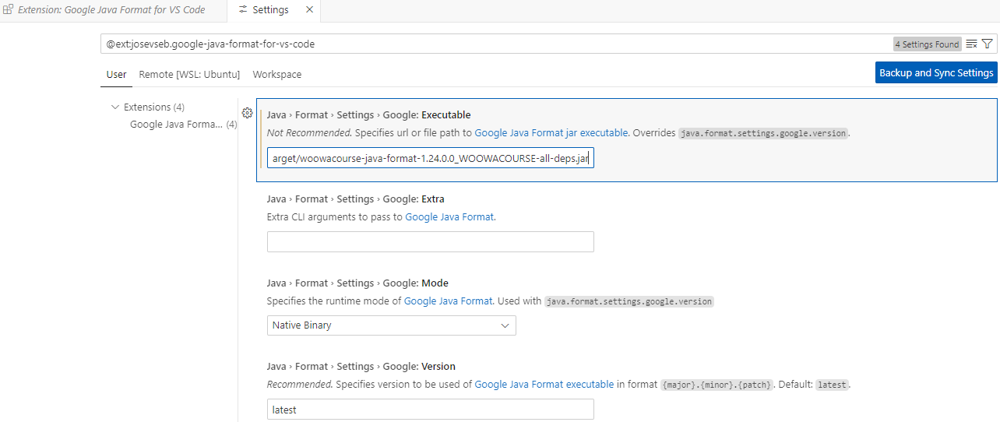

단축키를 참고하세요: `(Command(or Control) + Shift + P`

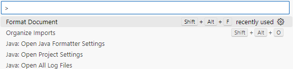

[Google Java Format for VS Code]: https://marketplace.visualstudio.com/items?itemName=JoseVSeb.google-java-format-for-vs-code

### [다운로드][]하고 Eclipse에 Plugin 설치하기

Import 순서 고치는 기능과, 문자열 상수의 열 제한 초과를 방지하는 Reflow 기능이 없습니다. 추가 예정이지만 선택할 UI가 없을 것 같으니 Eclipse Plugin 대신 후술할 [Spotless Plugin](#기타-Plugin-설치하기)을 사용해도 좋습니다.

`woowacourse-java-format-eclipse-plugin-1.25.0.0_WOOWACOURSE.jar` 파일을 [다운로드][]하고 `dropins` 폴더에 옮겨 주세요.

`google-java-format` 또는 그에 상응하는 jar 파일과 함께 있으면 동작하지 않으니 유일하게 존재하도록 주의해 주세요.

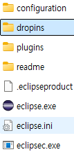

IntelliJ처럼 [VM Options][] 설정이 필요합니다. `eclipse.ini` 파일의 -vmargs 하위에 입력해 주세요:

[VM Options]: #intellij-jre-config

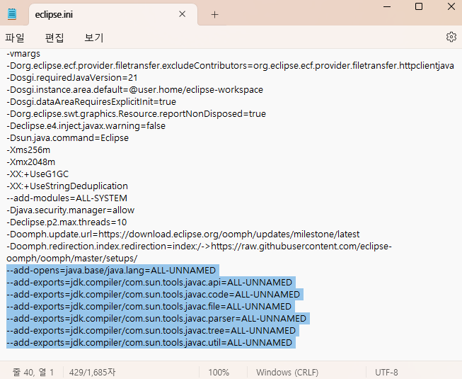

재시작한 다음부터는 프로젝트별 또는 전역 활성화가 필요합니다. 전역 설정은 `Window > Preferences > Java > Code Style > Formatter > Formatter Implementation > woowacourse-java-format`에서 할 수 있습니다. 프로젝트는 Package Explorer에서 프로젝트를 선택하고 우클릭 메뉴의 `Properties` 또는 `File > Properties`에서 `Java Code Style > Formatter > Enable project specific settings > Formatter Implementation > woowacourse-java-format`으로 설정하면 됩니다:

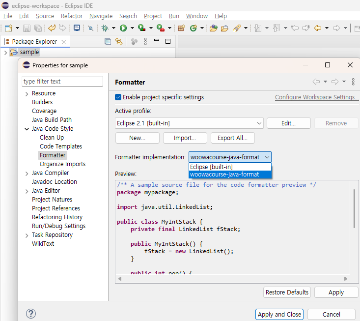


### Maven이나 Gradle로 설치하기

```xml
  <dependencies>
    <dependency>
      <groupId>io.github.yhkee0404.woowacoursejavaformat</groupId>
      <artifactId>woowacourse-java-format</artifactId>
      <version>${project.version}</version>
    </dependency>
  </dependencies>
```

[pom.xml]: https://github.com/yhkee0404/woowacourse-java-format/blob/main/eclipse_plugin/pom.xml
[build.gradle.kts]: https://github.com/yhkee0404/woowacourse-java-format/blob/main/idea_plugin/build.gradle.kts

```kotlin
dependencies {
  implementation("io.github.yhkee0404.woowacoursejavaformat:woowacourse-java-format:${googleJavaFormatVersion}")
}

repositories {
  mavenCentral()
}
```

#### 기타 Plugin 설치하기

다양한 IDE를 지원하는 [Spotless IDE Integration][], Gradle Plugin, Maven Plugin, GitHub Actions 등에서 설치할 수 있습니다:

[JEP 396]: https://openjdk.java.net/jeps/396
[Spotless IDE Integration]: https://github.com/diffplug/spotless/blob/main/plugin-gradle/IDE_HOOK.md
[Spotless Gradle Plugin]: https://github.com/diffplug/spotless/tree/main/plugin-gradle#google-java-format
[Spotless Maven Plugin]: https://github.com/diffplug/spotless/tree/main/plugin-maven#google-java-format

*   Gradle plugins
    *   [Spotless Gradle Plugin][]
    *   [sherter/google-java-format-gradle-plugin](https://github.com/sherter/google-java-format-gradle-plugin)
*   Apache Maven plugins
    *   [Spotless Maven Plugin][]
    *   [spotify/fmt-maven-plugin](https://github.com/spotify/fmt-maven-plugin)
    *   [talios/googleformatter-maven-plugin](https://github.com/talios/googleformatter-maven-plugin)
    *   [Cosium/maven-git-code-format](https://github.com/Cosium/maven-git-code-format):
        Commit할 때마다 자동 포매팅
*   SBT plugins
    *   [sbt/sbt-java-formatter](https://github.com/sbt/sbt-java-formatter)
*   [Github Actions](https://github.com/features/actions)
    *   [googlejavaformat-action](https://github.com/axel-op/googlejavaformat-action):
        Push할 때마다 자동 포매팅

#### Java 소스 코드에서 함수 사용하기

JDK 16 이상이라면 IntelliJ나 Eclipse처럼 [VM Options][] 설정이 필요합니다: [JEP 396][]: Strongly Encapsulate JDK Internals by Default

package나 디렉토리 이름에 `woowacourse`를 반영하지 않았습니다. [Upstream][google-java-format]과의 비교를 쉽게 하기 위해서입니다.

```java
import com.google.googlejavaformat.java.Formatter;
```

```java
String formattedSource = new Formatter().formatSource(sourceString);
```

```java
CharSource source = ...
CharSink output = ...
new Formatter().formatSource(source, output);
```

## 빌드해 보기

다음 파일들을 빌드할 수 있습니다:

```zsh
core/target/woowacourse-java-format-1.25.0.0_WOOWACOURSE-all-deps.jar
core/target/woowacourse-java-format-1.25.0.0_WOOWACOURSE-javadoc.jar
core/target/woowacourse-java-format-1.25.0.0_WOOWACOURSE-sources.jar
core/target/woowacourse-java-format-1.25.0.0_WOOWACOURSE.jar
eclipse_plugin/target/woowacourse-java-format-eclipse-plugin-1.25.0.0_WOOWACOURSE.jar
idea_plugin/build/distributions/project.zip
```

[docker-compose.yml][] 파일이 요구하는 WOOWACOURSE_LOCAL_VERSION을 입력해 주세요:

[docker-compose.yml]: https://github.com/yhkee0404/woowacourse-java-format/blob/main/docker-compose.yml

```zsh
WOOWACOURSE_LOCAL_VERSION=1.25.0.0_WOOWACOURSE_LOCAL UID=$(id -u) GID=$(id -g) docker compose up -d core
```

core 빌드를 마치면 동일한 WOOWACOURSE_LOCAL_VERSION으로 eclipse_plugin과 idea_plugin도 빌드할 수 있습니다.

```zsh
WOOWACOURSE_LOCAL_VERSION=1.25.0.0_WOOWACOURSE_LOCAL UID=$(id -u) GID=$(id -g) docker compose up -d eclipse_plugin
```

```zsh
WOOWACOURSE_LOCAL_VERSION=1.25.0.0_WOOWACOURSE_LOCAL UID=$(id -u) GID=$(id -g) docker compose up -d idea_plugin
```

idea_plugin 빌드 시 알려진 오류가 발생해 [해결책](https://youtrack.jetbrains.com/issue/JBR-1550/EXCEPTIONACCESSVIOLATION-in-sun.awt.windows.ThemeReader.getThemeMargins-building-a-plugin-with-OpenJDK-JBRE-for-IntelliJ-EAP#focus=Comments-27-3515408.0-0)을 파악 중이지만 결국 빌드는 성공하고 사용에 문제는 없으니 일단 무시해 주세요: JetBrains/intellij-platform-gradle-plugin#1513

```zsh
> Task :buildSearchableOptions
CompileCommand: exclude com/intellij/openapi/vfs/impl/FilePartNodeRoot.trieDescend bool exclude = true
java.lang.Error: no ComponentUI class for: com.intellij.util.ui.tree.PerFileConfigurableBase$PerFileConfigurableComboBoxAction$1[,0,0,0x0,invalid,alignmentX=0.0,alignmentY=0.0,border=,flags=0,maximumSize=,minimumSize=,preferredSize=,defaultIcon=,disabledIcon=,disabledSelectedIcon=,margin=null,paintBorder=true,paintFocus=true,pressedIcon=,rolloverEnabled=false,rolloverIcon=,rolloverSelectedIcon=,selectedIcon=,text=,defaultCapable=true]
```

빌드한 `project.zip` 파일을 `File > Settings > Plugins > Install Plugin from Disk...`에서 선택하면 설치됩니다:

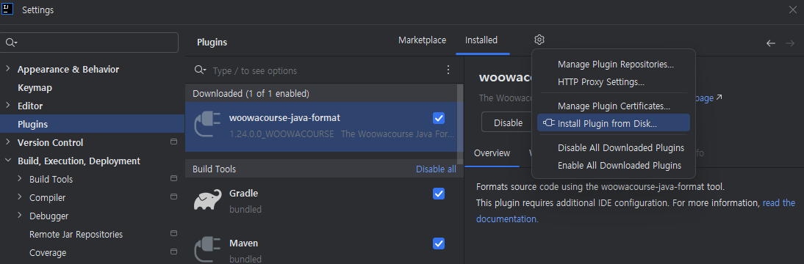

혹시 윈도우 등에서 Docker Container가 `root` 사용자로 실행되어 파일 소유자가 변경된 경우가 `ls -al` 등으로 확인된다면 다음 실행으로 해결할 수 있습니다:

```zsh
sudo chown -R `id -u`:`id -g` .
```
